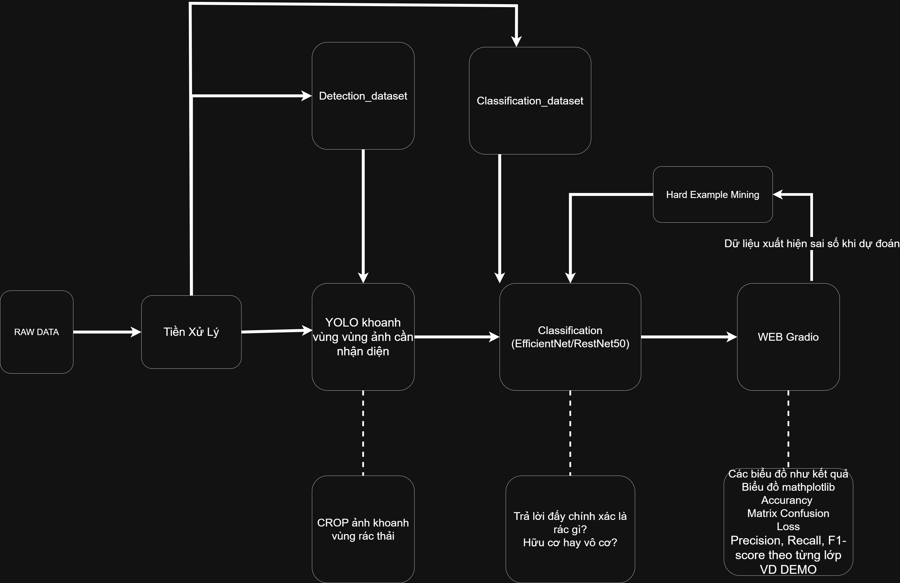

# Waste Classification and Detection Project

## 1. Mục tiêu đề tài

Đề tài xây dựng hệ thống nhận diện và phân loại rác thải dựa trên Deep Learning, gồm hai bài toán chính:

1. **Classification**: phân loại ảnh rác thành 16 lớp chi tiết như `plastic`, `paper`, `glass`, `meat_waste`, `starch_waste`, `mixed_food_waste`,...
2. **Detection**: phát hiện vùng chứa rác trong ảnh bằng YOLO.
3. **Mapping nhãn**: sau khi phân loại nhãn chi tiết, hệ thống ánh xạ kết quả sang nhóm lớn `organic` hoặc `inorganic`.

Pipeline cuối cùng hướng tới:

```text
Ảnh đầu vào
    ↓
YOLOv8 detect vùng rác
    ↓
Crop từng object
    ↓
Classifier dự đoán 16 lớp chi tiết
    ↓
Mapping fine label → organic/inorganic
    ↓
Hiển thị kết quả
```

---

## 2. Pipeline tổng quát



---

## 3. Cấu trúc thư mục

```text
source/
├── data/
│   ├── Dataset_classification_processed/
│   │   └── fine/
│   │       ├── train/
│   │       ├── val/
│   │       └── test/
│   │
│   └── Detection_dataset_processed/
│       ├── images/
│       │   ├── train/
│       │   ├── val/
│       │   └── test/
│       ├── labels/
│       │   ├── train/
│       │   ├── val/
│       │   └── test/
│       └── data.yaml
│
├── scripts/
│   ├── check_classification_dataset.py
│   ├── check_yolo_dataset.py
│   ├── train_classification_baseline.py
│   └── app_classification_test.py
│
├── requirements.txt
├── requirements_gpu.txt
├── README.md
└── README_TRAINING.md
```

Lưu ý: dataset, model, kết quả training và môi trường ảo không lưu trực tiếp trên GitHub. Các phần này nên để trên Google Drive hoặc lưu nội bộ.

---

## 4. Dataset classification/detection

### 4.1. Classification dataset

Classification dataset sau xử lý nằm tại:
```text
data/Dataset_classification_processed/fine/
```

Bên trong gồm:
```text
fine/
├── train/
├── val/
└── test/
```

Bộ classification hiện tại:
```text
Tổng ảnh: 17,887
Số lớp: 16
Ảnh lỗi: 0
Thư mục class bị thiếu: 0
```

16 lớp classification:
```text
battery
biological
cardboard
clothes
fruit_waste
glass
meat_waste
metal
mixed_food_waste
paper
plant_waste
plastic
shoes
starch_waste
trash
vegetable_waste
```

### 4.2. Detection dataset

Detection dataset sau xử lý nằm tại:

```text
data/Detection_dataset_processed/
```

Cấu trúc YOLO:

```text
Detection_dataset_processed/
├── images/
│   ├── train/
│   ├── val/
│   └── test/
├── labels/
│   ├── train/
│   ├── val/
│   └── test/
└── data.yaml
```

Kết quả kiểm tra detection dataset:

```text
Tổng ảnh: 9,132
Tổng label: 9,132
```

Dataset detection dùng để train YOLOv8 phát hiện vùng chứa rác.

---

## 5. Mapping 16 class → organic/inorganic

Hệ thống không chỉ dự đoán `organic/inorganic` trực tiếp. Thay vào đó, mô hình classification dự đoán nhãn chi tiết trước, sau đó ánh xạ sang nhóm lớn.

### Organic

```text
fruit_waste       → organic
vegetable_waste   → organic
meat_waste        → organic
starch_waste      → organic
plant_waste       → organic
mixed_food_waste  → organic
biological        → organic
```

### Inorganic

```text
battery    → inorganic
cardboard  → inorganic
clothes    → inorganic
glass      → inorganic
metal      → inorganic
paper      → inorganic
plastic    → inorganic
shoes      → inorganic
trash      → inorganic
```

---


## 6. Cài đặt nhanh

Mở terminal tại thư mục `source`:

```powershell
cd "E:\Deep_learning\đồ án\source"
```

Tạo và kích hoạt môi trường:

```powershell
python -m venv DeepL
.\DeepL\Scripts\Activate.ps1
```

Cài thư viện:

```powershell
python -m pip install -r requirements.txt
python -m pip install -r requirements_gpu.txt
```

Kiểm tra GPU:

```powershell
python -c "import torch; print(torch.__version__); print('CUDA:', torch.cuda.is_available()); print('GPU:', torch.cuda.get_device_name(0) if torch.cuda.is_available() else 'CPU')"
```

---

## 7. Check dataset nhanh

Check classification dataset:

```powershell
python scripts\check_classification_dataset.py
```

Check detection dataset:

```powershell
python scripts\check_yolo_dataset.py
```

Nếu kết quả classification không có ảnh lỗi và detection có số ảnh bằng số label thì dữ liệu đã sẵn sàng.

---

## 8. Demo classification nhanh

File demo classification:

```text
scripts/app_classification_test.py
```

Trước khi chạy, sửa `MODEL_PATH` trong file:

```python
MODEL_PATH = BASE_DIR / "runs" / "classification" / "<tên_thư_mục_model>" / "best_model.pth"
```

Chạy demo:

```powershell
python scripts\app_classification_test.py
```

Nếu chạy đúng, terminal sẽ hiện:

```text
Running on local URL: http://127.0.0.1:7860
```

Demo hiện tại trả về:

```text
Fine label
Coarse label organic/inorganic
Confidence
Top 5 dự đoán
```

---

## 9. Link Google Drive dataset/model

Do dataset và model có dung lượng lớn, không lưu trực tiếp trên GitHub.

```text
Dataset: https://drive.google.com/drive/u/0/folders/1Jo81xS7--e9uifOLvG3EbcCAwwmeXu9V

Trained models / runs: https://drive.google.com/drive/u/0/folders/1Jo81xS7--e9uifOLvG3EbcCAwwmeXu9V

```

Thành viên nhóm sau khi clone repo cần tải dữ liệu từ Drive và đặt đúng cấu trúc:

```text
source/
└── data/
    ├── Dataset_classification_processed/
    └── Detection_dataset_processed/
```

Sau đó chạy check dataset trước khi train hoặc demo.
